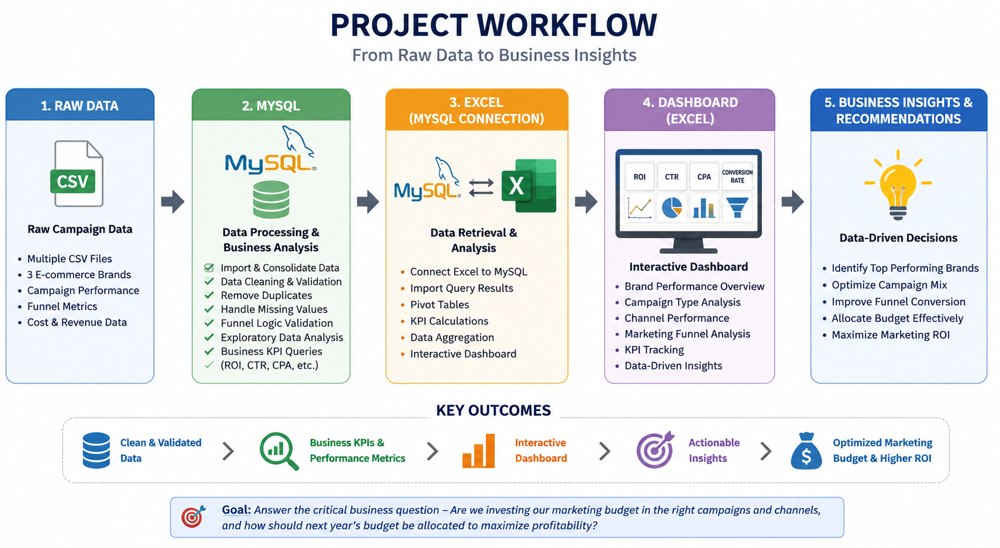

# Marketing Analytics: Campaign Performance & Funnel Analysis
## Project Overview

This project analyzes digital marketing campaign performance across three e-commerce brands to understand how marketing investments translate into business outcomes. The objective is to use data analytics to evaluate marketing effectiveness, identify performance drivers throughout the marketing funnel, and recommend data-driven budget allocation strategies.

Rather than simply reporting campaign metrics, this project demonstrates how marketing data can support strategic business decisions.

## Project Workflow

  

## Business Problem

Over the past year, the company has invested thousands of marketing campaigns across multiple channels. However, management needs to answer an important business question:

Are we investing our marketing budget in the right campaigns and channels, and how should next year's budget be allocated to maximize profitability?

To answer this question, the project follows a three-pillar analytical framework.

## Business Objectives
### Pillar 1 – Evaluate Overall Marketing Performance

Business Question

Which brand generates the highest return from its marketing investment?

Objective

Compare overall campaign performance across brands.
Measure marketing efficiency using ROI rather than revenue alone.
Identify which brand delivers the strongest return for every dollar spent.

Business Decision

Determine which brand deserves additional investment.
Identify brands requiring strategy optimization.
### Pillar 2 – Diagnose Marketing Funnel Performance

Business Question

Which campaign types and marketing channels drive the best results, and where do customers drop off in the marketing funnel?

Objective

Analyze each stage of the marketing funnel:

Impressions → Awareness
Clicks → Interest
Leads → Consideration
Conversions → Purchase

Key metrics include:

Click-Through Rate (CTR)
Lead Conversion Rate
Conversion Rate
Cost per Acquisition (CPA)
ROI

The analysis identifies whether performance issues originate from:

ineffective advertising,
poor audience targeting,
or weak post-click conversion.

Business Decision

Optimize high-performing channels.
Improve underperforming funnel stages.
Recommend campaign types that generate the highest ROI.
### Pillar 3 – Optimize Future Marketing Budget

Business Question

If next year's marketing budget increases, where should additional investment be allocated?

Objective

Identify:

profitable campaigns,
scalable marketing channels,
high-performing campaign types,
opportunities to reduce inefficient spending.

Rather than allocating budget solely based on revenue, recommendations consider:

ROI
Acquisition Cost
Conversion Performance
Campaign Efficiency
Marketing Funnel Performance

Business Decision

Provide actionable recommendations for marketing budget allocation based on data rather than intuition.

Dataset

The dataset simulates digital marketing campaigns from an e-commerce platform.

Each record represents one marketing campaign and includes:

Campaign Type
Marketing Channel
Target Audience
Impressions
Clicks
Leads
Conversions
Revenue
Acquisition Cost
ROI
Campaign Date
Brand

## Tools Used
MySQL — data storage, data cleaning and business analysis queries
Excel — exploratory analysis and validation
Tablue — interactive dashboard and KPI visualization
