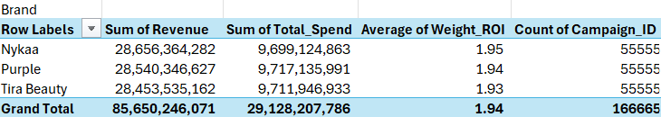
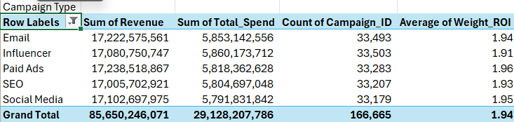
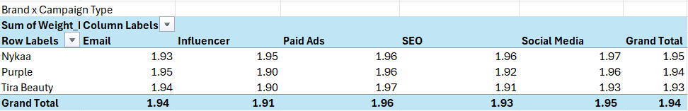
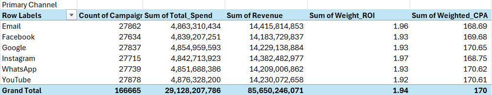
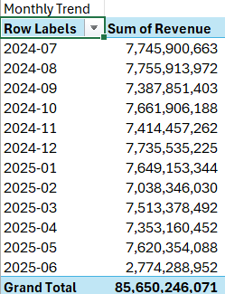
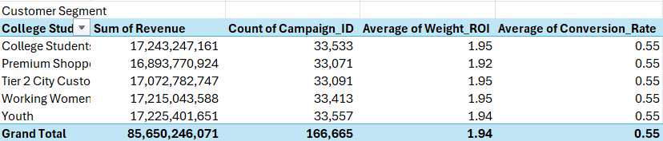
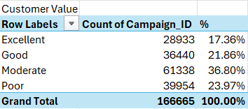

# Executive Summary

## Project Objective

This project analyzes digital marketing campaign performance across three e-commerce brands to evaluate marketing effectiveness, identify customer behavior throughout the marketing funnel, and provide data-driven recommendations for future marketing budget allocation.

---

# Executive Dashboard

## Brand Overview

### Key Findings

Nykaa achieved the highest Weighted ROI (1.95), indicating that it generated the greatest return on marketing investment among the three brands. Purplle ranked second with a Weighted ROI of 1.94, while Tira Beauty recorded the lowest Weighted ROI at 1.93. Although all three brands generated similar levels of revenue and incurred comparable marketing spend, Nykaa demonstrated the most efficient use of its marketing budget by converting advertising investment into revenue more effectively than its competitors. This suggests that Nykaa's marketing strategy and campaign execution were more effective, making it the strongest candidate for additional marketing investment

---

## Campaign Type Performance

### Key Findings

Paid Ads achieved the highest Weighted ROI (1.96), making it the most profitable marketing channel among those analyzed. This indicates that Paid Ads generated the greatest return on marketing investment and delivered the strongest overall campaign performance. Social Media ranked second with a Weighted ROI of 1.95, demonstrating consistently strong and stable investment efficiency. In contrast, Influencer Marketing recorded the lowest Weighted ROI (1.91), suggesting that it was the least efficient channel in converting marketing spend into revenue. These findings indicate that future marketing budgets should prioritize high-performing channels such as Paid Ads and Social Media, while the Influencer channel should be reviewed and optimized before receiving additional investment.

---

## Brand vs Campaign Type

### Key Findings

For Nykaa, Social Media delivered the highest Weighted ROI (1.97), while Email generated the lowest ROI (1.93). In contrast, Paid Ads was the best-performing channel for both Purplle and Tira Beauty, achieving Weighted ROIs of 1.96 and 1.97, respectively. Overall, the results indicate that Paid Ads and Social Media consistently generate the strongest returns on marketing investment across brands, making them the most effective channels for driving profitability. By comparison, Influencer Marketing recorded the lowest overall Weighted ROI (1.91), suggesting that it is the least efficient channel in converting marketing spend into revenue. These findings suggest that future marketing budgets should prioritize Paid Ads and Social Media, while the Influencer channel should be optimized or reassessed before additional investment is allocated.

---

## Primary Channel Analysis

### Key Findings
Instagram achieved the highest Weighted ROI (1.97), making it the most profitable marketing channel in terms of return on investment. Email ranked a close second with a Weighted ROI of 1.97 while also recording the lowest Weighted CPA ($168.53), indicating that it acquired customers more cost-effectively than any other channel. In contrast, YouTube and Google generated the lowest Weighted ROI (1.92–1.93) and the highest Weighted CPA (approximately $170.69), suggesting that these channels required higher acquisition costs while delivering relatively lower returns on marketing investment.

Campaign distribution was relatively balanced across all marketing channels, with approximately 27,000 campaigns per channel. This balanced dataset reduces potential bias and makes the performance comparison across channels more reliable. Based on these findings, Instagram and Email should be prioritized for future marketing investment due to their strong profitability and cost efficiency, while Google and YouTube campaigns should be reviewed and optimized to improve conversion efficiency before additional budget is allocated.

---

## Monthly Performance

### Key Findings

December 2024 recorded the highest cumulative ROI (40,575.22), while June 2025 had the lowest (14,470.43). It is important to note that these figures represent the total ROI accumulated across thousands of campaigns, rather than the monthly Weighted ROI, which remained relatively stable at around 1.9 throughout the analysis period. The lower cumulative ROI in June 2025 was primarily driven by a significantly smaller number of campaigns (5,428 campaigns), resulting in lower overall revenue generation. Overall, the results suggest that marketing performance was more consistent and effective during late 2024 and early 2025, when campaign activity was higher and total returns were stronger..

---

## Customer Segmentation

### Key Findings
Revenue was distributed relatively evenly across all customer segments, with each segment generating approximately $16–17 billion in revenue. Working Women and College Students achieved the highest Weighted ROI (1.95), indicating that these customer segments delivered the strongest return on marketing investment. In contrast, Premium Shoppers recorded the lowest Weighted ROI (1.92) despite generating revenue comparable to the other segments.

The Conversion Rate remained nearly identical across all customer segments (approximately 55%), suggesting that differences in ROI were not driven by conversion performance. Instead, the variation in ROI appears to be primarily influenced by customer spending behavior and revenue generated per conversion. These findings indicate that Working Women and College Students should be prioritized for future marketing investment, while campaigns targeting Premium Shoppers should be reviewed to improve revenue generation and overall marketing efficiency.

---

## Customer Value

### Key Findings
The Moderate performance category accounted for the largest share of campaigns (36.80%), indicating that most marketing campaigns delivered average results. This suggests there is significant opportunity to improve campaign performance and increase overall ROI through optimization strategies.

Good campaigns represented 21.87% of the total, while only 17.36% achieved an Excellent performance rating. This indicates that a relatively small proportion of campaigns generated exceptional returns on investment.

Notably, 23.97% of all campaigns were classified as Poor, meaning that nearly one in four campaigns underperformed and may have resulted in inefficient use of the marketing budget. These campaigns should be reviewed to identify issues such as ineffective targeting, weak creative content, or inappropriate channel selection.

Overall, the current ROI distribution indicates that campaign performance is uneven across the portfolio. Future optimization efforts should focus on improving Moderate campaigns to move them into the Good or Excellent category while addressing the root causes of Poor-performing campaigns. This approach will help maximize marketing efficiency and improve the overall return on investment without necessarily increasing the marketing budget.

---

# Overall Business Recommendations

- Increase investment in high-ROI brands and campaign types.
- Reduce spending on campaigns with consistently high CPA.
- Focus future marketing budgets on channels with strong conversion performance.
- Continuously monitor the marketing funnel to reduce customer drop-off and improve campaign efficiency.
